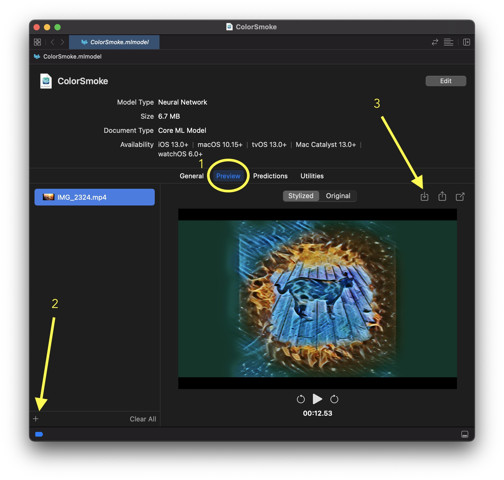
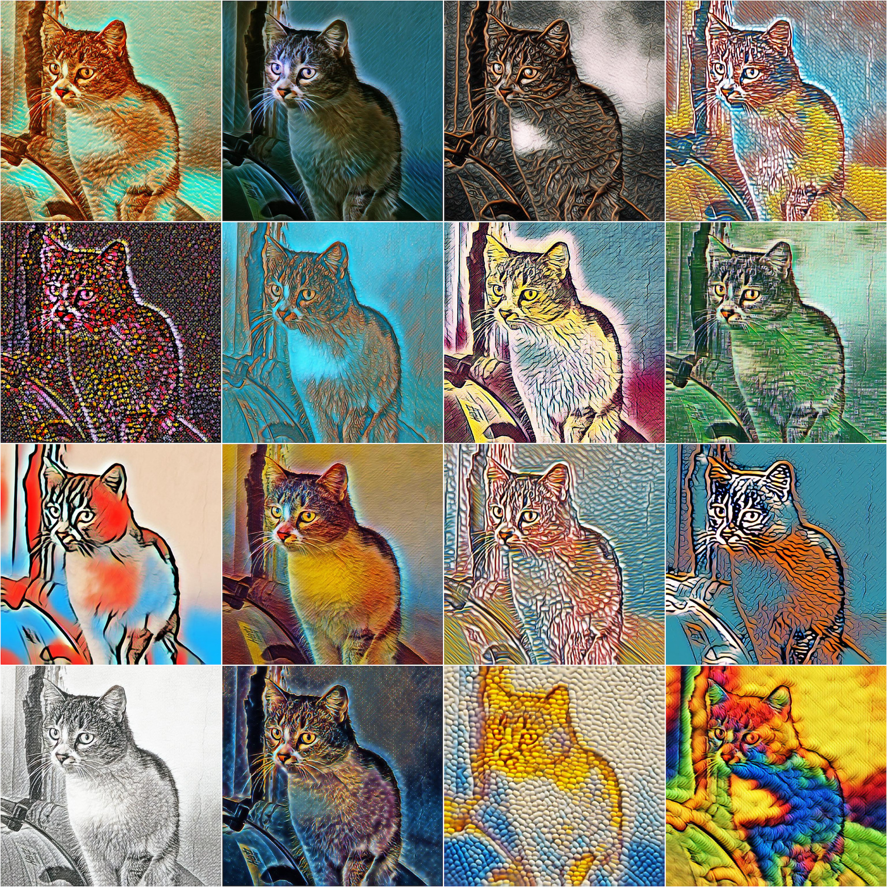

# CoreML-StyleTransfer

A few stylization coreML models that I've trained with [CreateML](https://developer.apple.com/machine-learning/create-ml/)

You can open and use the .mlmodel files in the "models" folder in Xcode:

You can also use test-all-styles.py as reference for inference using Python.

Here are inference examples for all the styles in this repository:

If you end up using these styles in your own projects, I'd be glad if you let me know :)